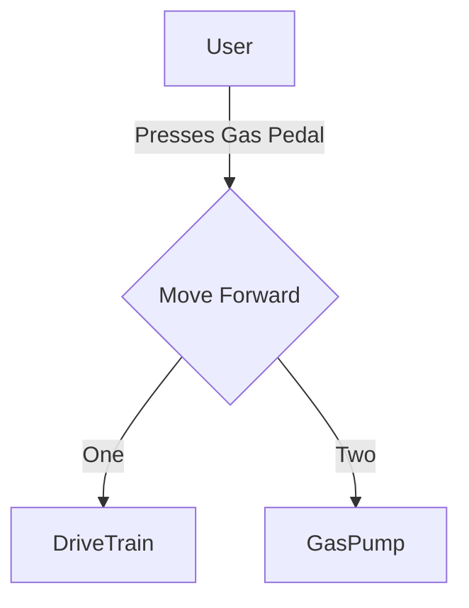

Unit 2 - Lesson 1

# Pizza Party From Vending Machines

Your class sees students getting snacks from the vending machine at school every minute and wonders if they could fix the broken one for a class pizza party. Your teacher asks the school, and they agree to fund it if you can program the outdated vending machine to work. The issue is that the vending machine is old and malfunctioning, requiring a rework of the code.

1. Explain a 3 step process of how a simple vending machine works?
    
   <textarea style="height: 100px; width: 100%"></textarea>

2. What are the inputs to this vending machine?
    
   <textarea style="height: 100px; width: 100%"></textarea>
3. What are the outputs to this vending machine?
    
   <textarea style="height: 100px; width: 100%"></textarea>

Upon analysis, the old vending machine only has these parts working, which you can program and interact with:

- Coin collection & counter mechanism
- Snack selection panel with five rows and three columns
- Snack dispenser mechanism for each of the 15 snacks

Before we start programming, let's design and structure how we want to build this program. First, let's choose a paradigm (or style) of programming:

- A **Declarative Paradigm** is what a program should do based on the condition. This targets the desired task, not how to do it (e.g.step by step).
- An **Imperative Paradigm** is when we declare what happens in a program. This runs the program step by step, the order of steps is crucial to function. (You're used to this approach)

4. What paradigm would we use if we want our program to work on vending machines that have different grid sizes?
    
   <textarea style="height: 100px; width: 100%"></textarea>

We'll use the declarative paradigm and then compare it with an imperative paradigm later. Now let's do some psuedocode.

5. What do you think the function `dispenseItem(X, Y)` does?
    
   <textarea style="height: 100px; width: 100%"></textarea>

6. How do you think the vending machine knows when to dispense the specified snacks? What conditions?
    
   <textarea style="height: 100px; width: 100%"></textarea>

7. What are the buttons on the number pad used for?
    
   <textarea style="height: 100px; width: 100%"></textarea>

8. What other commands could the vending machine perform?
    
   <textarea style="height: 100px; width: 100%"></textarea>

# Quick Summary

## Definitions:

- **Commands** - Instructions that a robot can follow to perform. In robots, they represent the actions the robot can take.
- **Buttons** - Physical or virtual elements that triggers specific commands. In robots, they are operator controls that send signals to the robot (commands) to do tasks.
- **Declarative paradigm** - Specifies the desired outcome or result, rather than specific steps to achieve it. You declare _what_ you want the program to do, no _how_ to do it.

## Check your understanding

You're in charge of programming a car's drive control. Answer the following questions based on this diagram.

1. What is the trigger for the "Move Forward" command?
    
   <textarea style="height: 100px; width: 100%"></textarea>

2. How would a "Stop" command fit into this flowchart?
    
   <textarea style="height: 100px; width: 100%"></textarea>

3. What other systems are involved when executing the "Move Forward" command?
    
   <textarea style="height: 100px; width: 100%"></textarea>
