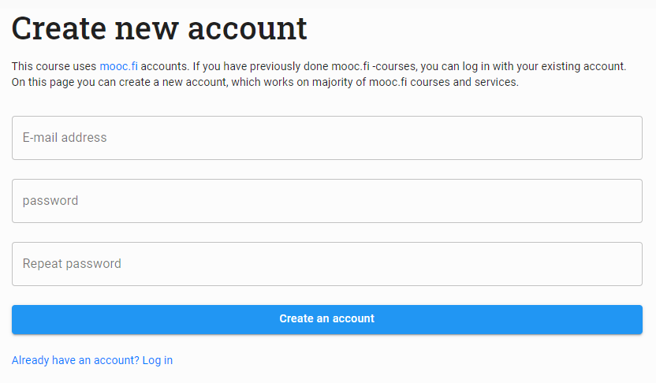
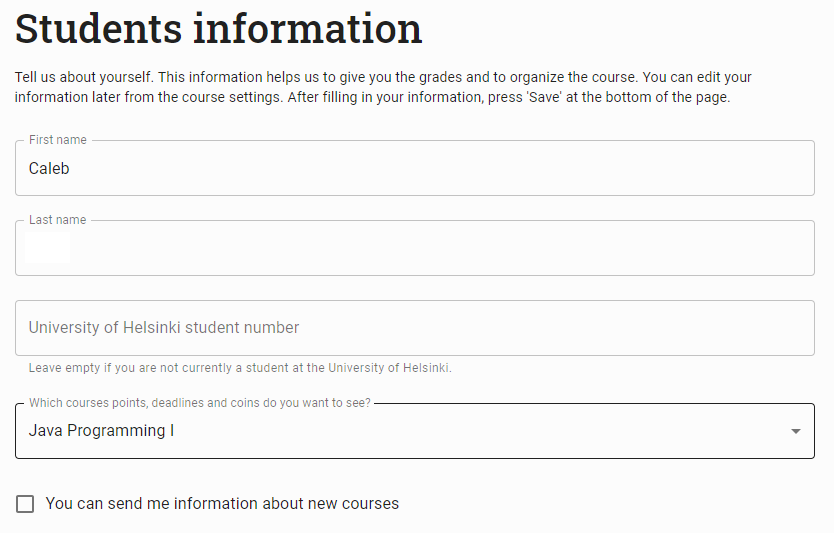
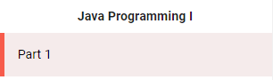

Lesson 1

# Java Introduction

Start learning Java here!

---

## Getting Started

### Workspaces

You should already have a workspace provided by Charging Courses Labs. This is located at this website [Charging Courses Labs](https://labs.chargingcourses.com). If you do not, please contact [Caleb](mailto:cvang07@jeffcityschools.org?subject=Charging%20Courses%20Labs%20Access) to get you setup with one.

Need a quick guide on how to navigate and use Charging Courses Labs? Use this document here:  
[Charging Courses Lab - Beginners Guide](https://docs.google.com/document/d/19QPRY87pi0oCVWngLRzcrOw9lH5MWkymnLeiUjZ0hiE/edit?usp=sharing)

### Creating a MOOC Account

Start by heading over to the Java MOOC:  
[Java Programming \- Mooc.fi](https://java-programming.mooc.fi/)

Create a new account with mooc.fi using the “Create new account” button in the top right.  

Fill out the following information and make sure to remember your password.  
Confirm your account via the email they sent you\!  

Make sure you select “Java Programming I” as the course you want to see.  

After creating your account, start with Part I of the Java Programming I  

### How to connect MOOC to your Workspace

Use this video tutorial to learn how to connect TestMyCode (TMC) to your VSCode in your workspace. TMC is used to submit your code for checks and assessments. You can also use it as a sandbox for your applications.

[Charging Courses - TMC VSCode Tutorial](https://drive.google.com/file/d/1--qNwt2_gcTgJaO03DhlK5e8SkCjYKEr/view?usp=sharing)

## Start Learning

After setting up your workspace to work with TestMyCode, you can start following along with the guide. There will be checkups and assessments throughout the weeks to check your progress and understanding. If you have any questions or need help, contact us here: [Contact](/docs/contact).

Each part of the Java MOOC course takes roughly 5 \- 15 hours depending on previous skills in programming. Please dedicate enough time to finish the lessons. You can work ahead

### Course Schedule

Here are the suggested deadlines for each part. To participate in the build season starting in January, you must complete these to know how to program in Java. We have additional courses that are robot-specific that will be taught. These courses will begin around part 5, where Object Oriented Programming is introduced.

| Deadline | Task   |
| :------- | :----- |
| Week 1   | Part 1 |
| Week 2   | Part 2 |
| Week 3   | Part 3 |
| Week 4   | Part 4 |
| Week 5   | Part 5 |
| Week 6   | Part 6 |
